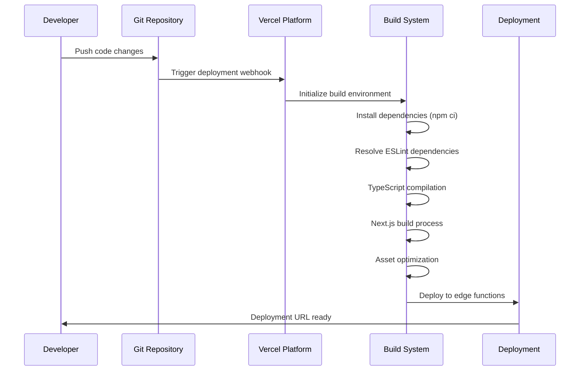

# Technical Design Document

## Overview

The cmon-project Vercel deployment architecture integrates a Next.js 15.5.0 frontend application with an embedded NestJS backend service. This hybrid deployment leverages Vercel's serverless infrastructure for the Next.js application while adapting the NestJS backend to work within Vercel's serverless functions framework.

### Key Design Decisions

1. **ESLint Dependency Resolution**: Address compatibility issues between eslint-plugin-import and ESLint 10.x by updating to compatible versions or removing problematic plugins
2. **Serverless Backend Integration**: Transform NestJS backend modules into Next.js API routes rather than attempting to deploy the full NestJS application
3. **Environment Segregation**: Implement secure environment variable management with sensitive data protection
4. **Build Optimization**: Configure aggressive caching and optimization strategies for production performance

## Architecture

### Deployment Architecture

```mermaid
graph TB
    subgraph "Vercel Platform"
        subgraph "Edge Network"
            CDN[Global CDN]
            SSL[SSL/TLS Termination]
        end
        
        subgraph "Serverless Functions"
            API1[/api/categories]
            API2[/api/products]
            API3[/api/products/[id]]
        end
        
        subgraph "Static Assets"
            Static[Static Files]
            Images[Optimized Images]
        end
        
        subgraph "Next.js Application"
            Pages[App Router Pages]
            Components[React Components]
        end
    end
    
    subgraph "External Services"
        DB[(Database)]
        Email[Email Service]
        Auth[Auth Provider]
    end
    
    CDN --> SSL
    SSL --> Pages
    SSL --> API1
    SSL --> API2 
    SSL --> API3
    SSL --> Static
    SSL --> Images
    
    API1 --> DB
    API2 --> DB
    API3 --> DB
    API2 --> Email
    API1 --> Auth
```

### Build Process Architecture



## Components and Interfaces

### 1. ESLint Configuration Resolution

**Current Issue**: The project uses ESLint 10.4.1 but eslint-config-next 16.2.7 expects ESLint ^9. This creates a peer dependency warning during Vercel builds.

**Root Cause Analysis**:
- ESLint 10.x introduced breaking changes in configuration format
- Next.js ESLint config versions lag behind latest ESLint releases
- Current eslint.config.mjs uses FlatCompat for compatibility but warnings persist

**Solution Strategy**:

1. **Primary Solution - Version Alignment**:
   - Downgrade ESLint to version ^9.15.0 (latest 9.x compatible with Next.js)
   - Keep eslint-config-next at current version 16.2.7
   - This eliminates peer dependency warnings completely

2. **Alternative Solution - Selective Ignoring**:
   - Maintain current ESLint 10.4.1 version
   - Use `eslint.ignoreDuringBuilds: true` in next.config.ts (already configured)
   - Add package.json override to silence peer dependency warnings

3. **Future-Proof Solution**:
   - Monitor Next.js ESLint config updates for ESLint 10.x support
   - Implement custom ESLint configuration without eslint-config-next dependency
   - Use Next.js core rules directly with manual configuration

**Implementation Interfaces**:
```typescript
// Package.json dependency resolution
interface DependencyResolution {
  eslint: "^9.15.0"; // Downgraded for compatibility
  "eslint-config-next": "^16.2.7"; // Current version
  "@eslint/eslintrc": "^3.3.5"; // Compatible version
}

// Alternative: Package override strategy
interface PackageOverrides {
  "eslint-config-next": {
    "eslint": "10.4.1"; // Force acceptance of ESLint 10.x
  };
}

// Enhanced eslint.config.mjs interface
interface ESLintConfig {
  extends?: string[];
  rules?: Record<string, string | [string, any]>;
  ignores: string[];
  settings?: {
    'import/resolver'?: {
      typescript: boolean;
      node: boolean;
    };
    next?: {
      rootDir: string;
    };
  };
}
```

### 2. Vercel Configuration Files

**vercel.json Configuration Interface**:
```typescript
interface VercelConfig {
  buildCommand: "npm run build";
  outputDirectory: ".next";
  installCommand: "npm ci";
  devCommand: "npm run dev";
  framework: "nextjs";
  functions: {
    "src/app/api/**/*.ts": {
      runtime: "nodejs20.x";
      maxDuration: 30;
      memory: 1024;
    };
  };
  regions: ["iad1"]; // Primary region (US East)
  env: Record<string, string>;
  build: {
    env: {
      NEXT_TELEMETRY_DISABLED: "1";
      NODE_ENV: "production";
    };
  };
  headers: [
    {
      source: "/(.*)",
      headers: [
        {
          key: "X-Content-Type-Options",
          value: "nosniff"
        },
        {
          key: "X-Frame-Options", 
          value: "DENY"
        },
        {
          key: "X-XSS-Protection",
          value: "1; mode=block"
        }
      ]
    }
  ];
}

interface FunctionConfig {
  runtime: "nodejs18.x" | "nodejs20.x";
  maxDuration: number; // seconds (max 30 for hobby plan)
  memory: 128 | 256 | 512 | 1024 | 1536 | 2048 | 3008; // MB
  regions?: string[]; // Optional: override default regions
}
```

**Next.js Configuration Enhancement**:
```typescript
// Enhanced next.config.ts
interface NextConfig {
  reactStrictMode: boolean;
  eslint: {
    ignoreDuringBuilds: boolean;
    dirs?: string[]; // Limit ESLint to specific directories
  };
  typescript: {
    ignoreBuildErrors: boolean; // Emergency fallback
  };
  experimental: {
    serverComponentsExternalPackages: string[]; // For NestJS compatibility
    outputFileTracingIncludes?: Record<string, string[]>;
  };
  images: {
    domains: string[]; // Allowed image domains
    formats: ["image/webp", "image/avif"];
    minimumCacheTTL: 604800; // 7 days
  };
  env: {
    CUSTOM_KEY: string;
  };
  redirects?: () => Promise<Redirect[]>;
  headers?: () => Promise<Header[]>;
}
```

### 3. Environment Variable Management

**Environment Variable Interface**:
```typescript
interface EnvironmentConfig {
  development: {
    NEXT_PUBLIC_API_URL: string;
    DATABASE_URL: string;
    JWT_SECRET: string;
  };
  production: {
    NEXT_PUBLIC_API_URL: string;
    DATABASE_URL: string;
    JWT_SECRET: string;
    EMAIL_SERVICE_API_KEY: string;
  };
}
```

### 4. NestJS Backend Integration Strategy

**Challenge**: NestJS is designed as a full server application, but Vercel functions are stateless and serverless.

**Current Structure**: Full NestJS application in `/src/app/backend/` with:
- Complete module system (auth, cart, categories, products, addresses, email)
- TypeORM database integration
- Passport authentication strategies
- Bull queue system for email processing
- Winston logging configuration
- Comprehensive test suite

**Integration Approach Options**:

1. **Hybrid API Route Strategy** (Recommended):
   - Keep existing Next.js API routes in `/src/app/api/`
   - Extract business logic from NestJS services into shared utilities
   - Create lightweight API handlers that use NestJS services as libraries
   - Maintain NestJS for local development and testing

2. **Full Migration Strategy**:
   - Convert all NestJS controllers to Next.js API routes
   - Migrate all services to Next.js compatible utilities
   - Adapt TypeORM configuration for serverless environment
   - Replace Bull queues with Vercel Edge Functions or external queues

3. **Serverless Function Wrapper Strategy**:
   - Create a single serverless function that runs NestJS
   - Use cold start optimization techniques
   - Implement request routing within the wrapper
   - Maintain full NestJS functionality

**Implementation Interfaces**:

```typescript
// Service extraction interface
interface ServiceExtraction {
  source: {
    nestjsService: string;
    methods: string[];
    dependencies: string[];
  };
  target: {
    utilityFunction: string;
    apiRoute: string;
    sharedTypes: string;
  };
}

// API route migration interface
interface APIRouteMigration {
  nestjsController: {
    path: string;
    methods: ControllerMethod[];
    guards: string[];
    interceptors: string[];
  };
  nextjsRoute: {
    filePath: string;
    exportedHandlers: HTTPMethod[];
    middleware: MiddlewareFunction[];
  };
}

// Database integration interface
interface DatabaseIntegration {
  typeorm: {
    entities: string[];
    migrations: string[];
    connection: ConnectionConfig;
  };
  serverless: {
    connectionPooling: boolean;
    maxConnections: number;
    connectionTimeout: number;
    idleTimeout: number;
  };
}

// Service mapping for hybrid approach
interface ServiceMapping {
  authService: {
    source: "src/app/backend/src/auth/auth.service.ts";
    target: "src/lib/auth-service.ts";
    exports: ["validateUser", "generateToken", "verifyToken"];
  };
  categoriesService: {
    source: "src/app/backend/src/categories/categories.service.ts";
    target: "src/lib/categories-service.ts";
    exports: ["findAll", "findOne", "create", "update", "remove"];
  };
  productsService: {
    source: "src/app/backend/src/products/products.service.ts"; 
    target: "src/lib/products-service.ts";
    exports: ["findAll", "findOne", "create", "update", "remove"];
  };
}
```

## Data Models

### 1. Deployment Configuration Model

```typescript
interface DeploymentConfig {
  id: string;
  projectName: string;
  framework: 'nextjs';
  buildCommand: string;
  outputDirectory: string;
  installCommand: string;
  nodeVersion: string;
  environmentVariables: EnvironmentVariable[];
  domains: Domain[];
  functions: FunctionConfig[];
}

interface EnvironmentVariable {
  key: string;
  value: string;
  type: 'plain' | 'sensitive';
  target: 'production' | 'preview' | 'development';
  gitBranch?: string;
}

interface Domain {
  name: string;
  redirect?: string;
  gitBranch?: string;
}
```

### 2. Build Optimization Model

```typescript
interface BuildOptimization {
  bundleAnalysis: {
    javascriptSize: number;
    cssSize: number;
    imageOptimization: boolean;
    treeShaking: boolean;
  };
  caching: {
    staticAssets: CacheConfig;
    apiResponses: CacheConfig;
    images: CacheConfig;
  };
  performance: {
    firstContentfulPaint: number;
    largestContentfulPaint: number;
    cumulativeLayoutShift: number;
  };
}

interface CacheConfig {
  maxAge: number;
  staleWhileRevalidate?: number;
  immutable: boolean;
}
```

### 3. NestJS to Next.js Migration Model

```typescript
interface MigrationMapping {
  sourceModule: string;
  targetRoute: string;
  dependencies: string[];
  services: ServiceMapping[];
  guards: GuardMapping[];
}

interface ServiceMapping {
  sourceService: string;
  targetUtility: string;
  dependencies: string[];
}

interface GuardMapping {
  sourceGuard: string;
  targetMiddleware: string;
  validationRules: ValidationRule[];
}
```

## Correctness Properties

*A property is a characteristic or behavior that should hold true across all valid executions of a system—essentially, a formal statement about what the system should do. Properties serve as the bridge between human-readable specifications and machine-verifiable correctness guarantees.*

Based on the prework analysis, most requirements for this feature involve infrastructure configuration, deployment processes, and platform behavior rather than testable code logic. After performing property reflection to eliminate redundancy, the following properties provide unique validation value:

### Property 1: API Response Format Consistency
*For any* API route response, the system SHALL return proper Content-Type headers set to "application/json" for JSON responses, valid parseable JSON structure for successful requests, HTTP status 500 with {"error": "description"} format for server errors, and HTTP status 404 with {"error": "Not found"} format for invalid endpoints.
**Validates: Requirements 2.2, 2.4, 2.5, 2.6**

### Property 2: Backend Functionality Preservation
*For any* request to NestJS backend functionality (auth, cart, categories, products, addresses, email), the deployed system SHALL maintain the same behavior as the local development environment.
**Validates: Requirements 3.3**

### Property 3: Environment Variable Validation Error Handling
*For any* missing or invalid environment variable during build, the build process SHALL fail with an error message that lists the specific missing variables and provides specific error descriptions for format validation failures.
**Validates: Requirements 4.5, 4.6**

### Property 4: Build Error Reporting Consistency
*For any* build failure (TypeScript compilation errors, dependency installation failures), the error message SHALL include specific information (file paths, line numbers, error descriptions, failing package names) and complete within specified time limits.
**Validates: Requirements 1.6, 6.3, 6.6**

### Property 5: Image Optimization Performance
*For any* image served by the deployment system, the optimized file size SHALL be at least 30% smaller than the original while maintaining visual quality.
**Validates: Requirements 5.4**

### Property 6: Asset Caching Headers Consistency
*For any* static asset (JavaScript, CSS, or images) served by the deployment system, the response SHALL include appropriate cache-control headers: "public, max-age=31536000, immutable" for JavaScript and CSS assets, and "public, max-age=604800" for image assets.
**Validates: Requirements 5.6, 5.7, 5.8**

### Property 7: Domain Validation Error Handling
*For any* custom domain configuration that fails DNS verification, the system SHALL display specific error messages within 24 hours.
**Validates: Requirements 7.3**

### Property 8: HTTP to HTTPS Redirect Consistency
*For any* HTTP request to the deployment system, the response SHALL be a 301 redirect to the corresponding HTTPS URL within 100 milliseconds.
**Validates: Requirements 7.4**

### Property 9: Runtime Error Capture Completeness
*For any* runtime error that occurs in the deployed application, the monitoring system SHALL capture the error with complete stack trace information within 5 minutes.
**Validates: Requirements 8.2**

### Property 10: API Request Logging Completeness
*For any* API route request, the system SHALL log the HTTP method, endpoint, status code, and response time information.
**Validates: Requirements 8.3**

### Property 11: Critical Error Notification Timing
*For any* critical error (5xx status codes, application crashes), the system SHALL send email notifications within 5 minutes of occurrence.
**Validates: Requirements 8.5**

## Error Handling

### Build-Time Error Handling

**ESLint Configuration Errors**:
- Dependency conflicts between eslint-plugin-import and ESLint 10.x
- Resolution: Update to compatible versions or enable `eslint.ignoreDuringBuilds: true`
- Fallback: Implement Next.js built-in ESLint rules as replacement

**TypeScript Compilation Errors**:
- Missing type definitions or incompatible types
- Invalid syntax or import resolution failures
- Error reporting must include file paths, line numbers, and descriptions
- Build failure timeout: 10 minutes maximum

**Environment Variable Errors**:
- Missing required variables: DATABASE_URL, JWT_SECRET, EMAIL_SERVICE_API_KEY
- Invalid format or empty values
- Build termination within 60 seconds with specific error messages
- Error format: "Missing environment variables: [variable_names]"

**Dependency Installation Errors**:
- Network connectivity issues during npm install
- Version conflicts or missing packages
- Build termination within 5 minutes
- Error details must include failing package names

### Runtime Error Handling

**API Route Errors**:
- Database connection failures
- Authentication/authorization errors
- Validation errors for malformed requests
- Response format: `{"error": "specific error description"}`
- HTTP status codes: 400 (validation), 401 (auth), 403 (forbidden), 500 (server)

**NestJS Backend Integration Errors**:
- Module initialization failures
- Service dependency resolution errors
- Database schema mismatches
- Graceful degradation for non-critical services

**Image Optimization Errors**:
- Unsupported image formats
- File size exceeding limits
- Fallback to original image if optimization fails
- Logging of optimization failures for monitoring

**SSL Certificate Errors**:
- Certificate provisioning failures
- Domain validation timeouts
- Retry mechanism: every hour for 48 hours
- Fallback to Vercel default domain if custom domain fails

### Error Recovery Strategies

**Build Failure Recovery**:
1. Retry build process once for transient failures
2. Use cached dependencies when possible
3. Skip non-critical optimizations on failure
4. Provide detailed error logs for debugging

**Runtime Error Recovery**:
1. Automatic restarts for serverless functions
2. Circuit breaker pattern for external service calls
3. Graceful degradation for non-essential features
4. Error boundary implementation in React components

**Monitoring and Alerting**:
- Real-time error tracking with stack traces
- Performance metric monitoring (CPU, memory, response time)
- Email notifications for critical errors (5xx codes, crashes)
- Automatic log retention and cleanup (30-day retention)

## Testing Strategy

### Overview

The Vercel deployment testing strategy combines property-based testing for universal behaviors with integration testing for infrastructure and deployment-specific functionality. Since this feature primarily involves deployment configuration and platform integration, the majority of testing focuses on integration and smoke tests.

### Property-Based Testing

Property-based testing applies to the specific correctness properties identified in the design. These tests verify universal behaviors across all valid inputs:

**Configuration**:
- Test framework: Jest with fast-check library for property generation
- Minimum iterations: 100 per property test
- Each test references its corresponding design property using the tag format:
  - `Feature: vercel-deployment, Property {N}: {property description}`

### Property-Based Testing

Property-based testing applies to the consolidated correctness properties identified in the design. These tests verify universal behaviors that should hold across all valid inputs:

**Configuration**:
- Test framework: Jest with fast-check library for property generation
- Minimum iterations: 100 per property test
- Each test references its corresponding design property using the tag format:
  - `Feature: vercel-deployment, Property {N}: {property description}`

**Property Test Categories**:

1. **API Response Format Properties** (Property 1):
   - Generate various API requests (valid endpoints, invalid endpoints, error conditions)
   - Verify Content-Type headers, JSON structure validity, error response formats
   - Mock backend services to control response scenarios and error conditions
   - Test with different payload sizes, malformed requests, timeout scenarios

2. **Backend Functionality Properties** (Property 2):
   - Generate requests to NestJS backend functionality (auth tokens, cart operations, CRUD operations)
   - Compare responses between local development and deployed environments
   - Test with various user roles, permissions, and data states
   - Verify authentication flows, data validation, and business logic consistency

3. **Environment Variable Validation Properties** (Property 3):
   - Generate build scenarios with various missing environment variables
   - Generate scenarios with invalid environment variable formats (malformed URLs, invalid JSON, wrong data types)
   - Verify error messages include specific variable names and clear descriptions
   - Test edge cases like empty values, whitespace-only values, special characters

4. **Build Error Reporting Properties** (Property 4):
   - Generate TypeScript compilation errors (syntax errors, type mismatches, import failures)
   - Generate dependency installation failures (network issues, version conflicts, missing packages)
   - Verify error messages include file paths, line numbers, and specific error descriptions
   - Test error reporting timing and consistency across different error types

5. **Asset Optimization Properties** (Properties 5, 6):
   - Generate requests for various image formats and sizes
   - Generate requests for different asset types (JS, CSS, images)
   - Verify optimization percentages and caching headers are consistently applied
   - Test with edge cases like very small images, different compression algorithms

6. **Infrastructure Behavior Properties** (Properties 7-11):
   - Generate various domain configurations and HTTP/HTTPS requests
   - Generate runtime errors and API requests to test logging and monitoring
   - Verify redirect behavior, error capture timing, and notification delivery
   - Test with different error types, request patterns, and system load conditions

### Integration Testing

Integration tests verify deployment infrastructure behavior and platform-specific functionality:

**Build Process Integration**:
- Verify Next.js build completes successfully with App Router
- Test TypeScript compilation of both frontend and NestJS backend
- Validate dependency installation respects package-lock.json
- Test ESLint configuration resolution

**Deployment Integration**:
- Verify application deployment to Vercel platform
- Test static asset serving with correct HTTP status codes
- Validate API route accessibility and response times
- Test environment variable injection and security

**Performance Integration**:
- Measure bundle size reduction (JavaScript ≥20%, CSS ≥15%)
- Test image optimization achieves ≥30% size reduction
- Verify static HTML generation for eligible pages
- Measure page load times and Core Web Vitals

**Security Integration**:
- Verify HTTPS enforcement and TLS version compliance
- Test SSL certificate provisioning and renewal
- Validate environment variable encryption at rest
- Test domain validation and ownership verification

### Smoke Testing

Smoke tests verify basic deployment functionality with single execution:

**Configuration Verification**:
- Node.js version compatibility (18.x or 20.x)
- Required environment variables presence
- NestJS backend TypeScript compilation
- Package.json script execution

**Service Initialization**:
- Application startup within acceptable timeframes
- Module initialization and dependency injection
- Database connectivity and authentication
- External service integration (email, authentication)

### Unit Testing Balance

**Limited Unit Testing Scope**:
- Focus on utility functions and data transformation logic
- Test API route handlers in isolation with mocked dependencies
- Validate configuration parsing and environment variable processing
- Test error handling utilities and logging functions

**Emphasis on Integration**:
- Most functionality depends on Vercel platform behavior
- Infrastructure testing more valuable than isolated unit tests
- End-to-end verification ensures deployment success
- Platform-specific optimizations require integration testing

### Test Execution Strategy

**Development Phase**:
- Unit tests for utility functions and business logic
- Integration tests with local development server
- Property tests with mocked external dependencies
- ESLint and TypeScript compilation verification

**Deployment Verification**:
- Automated integration tests against deployed preview environments
- Performance benchmarking and optimization verification
- Security testing for HTTPS, certificate, and environment variable handling
- End-to-end user journey testing

**Production Monitoring**:
- Continuous integration tests against production APIs
- Performance monitoring and alerting
- Error tracking and analysis
- Log retention and audit trail verification

### Test Data Management

**Property Test Data Generation**:
- Random API request patterns and payloads
- Various environment variable combinations and invalid values
- Different image formats, sizes, and optimization scenarios
- Diverse error conditions and edge cases

**Integration Test Data**:
- Representative production-like datasets
- Valid and invalid configuration scenarios
- Performance benchmark baselines
- Security test vectors and attack patterns

This testing strategy ensures comprehensive coverage while recognizing that deployment features require extensive integration testing to verify platform-specific behavior and infrastructure integration.
